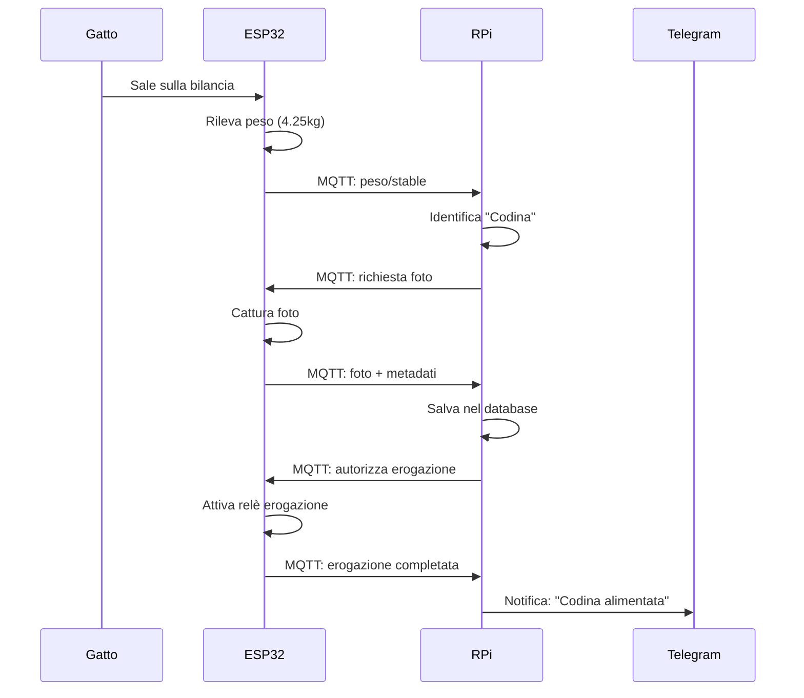
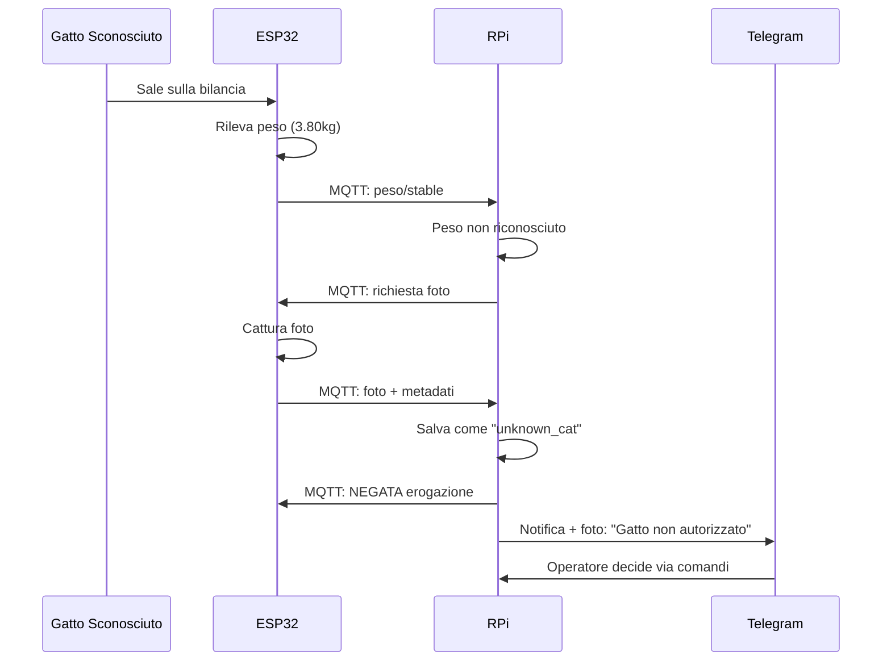
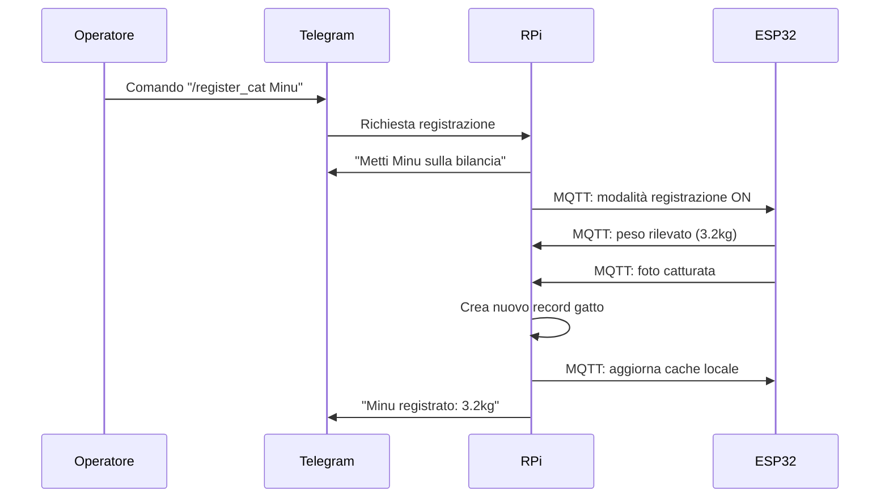

# Architettura Sistema di Alimentazione e Controllo Gatti

## 1. Panoramica del Sistema

Il sistema è composto da due unità principali che comunicano tramite MQTT per gestire l'accesso controllato al cibo e l'identificazione automatica dei gatti tramite peso e fotografie.

### 1.1 Componenti Hardware Principali

```
┌─────────────────────┐         MQTT/WiFi         ┌──────────────────────┐
│   RASPBERRY PI 5    │◄─────────────────────────►│    ESP32-S3 SENSE    │
│                     │                           │                      │
│ • Hailo AI Accel.   │                           │ • Camera integrata   │
│ • Camera USB/RPi    │                           │ • HX711 Load Cell    │
│ • Controllo Finestra│                           │ • Bilancia circolare │
│ • Database centrale │                           │ • Relè erogazione    │
│ • Bot Telegram      │                           │ • Cache locale       │
└─────────────────────┘                           └──────────────────────┘
        │                                                   │
        │                                                   │
   ┌────▼────┐                                         ┌────▼────┐
   │ FINESTRA│                                         │MANGIATOIA│
   │MOTORIZZATA                                        │ AUTOMATICA│
   │ • Servo │                                         │ • Erogatore│
   │ • Lock  │                                         │ • Piatto  │
   └─────────┘                                         └─────────┘
```

## 2. Hardware Dettagliato

### 2.1 Raspberry Pi 5 - Unità Centrale

**Componenti:**
- Raspberry Pi 5 (8GB RAM)
- Hailo-8L AI Accelerator
- Camera USB o Raspberry Pi Camera Module
- Scheda SD 64GB+
- Alimentatore 27W USB-C

**Connessioni:**
- USB: Camera, Hailo AI
- GPIO: Comunicazione seriale per controllo finestra
- Ethernet/WiFi: Connettività di rete
- HDMI: Debug (opzionale)

**Software Installato:**
- Raspberry Pi OS 64-bit
- Python 3.11+
- GStreamer + Hailo TAPPAS
- MQTT Broker (Mosquitto)
- Database SQLite
- Bot Telegram

### 2.2 ESP32-S3 Sense - Stazione Mangiatoia

**Componenti:**
- ESP32-S3 Sense (con camera OV2640)
- HX711 24-bit ADC Load Cell Amplifier
- Load Cell 5kg (o capacità appropriata)
- Piatto/bilancia circolare (diametro ~30cm)
- Relè 5V per controllo erogazione
- Alimentatore 5V/2A
- Case impermeabile per esterni

**Pin Assignment ESP32-S3:**
```
Camera (integrata):
- Pins as per main.cpp configuration

HX711 Load Cell:
- VCC  → 3.3V
- GND  → GND
- DT   → GPIO 4
- SCK  → GPIO 5

Relè Erogazione:
- VCC  → 5V
- GND  → GND
- IN   → GPIO 6
- NC/NO → Controllo erogatore meccanico

Status LED:
- LED_BUILTIN → GPIO 7
```

**Caratteristiche Bilancia:**
- Capacità: 5-10kg
- Risoluzione: 1-5g
- Tempo stabilizzazione: 2-3 secondi
- Materiale: Alluminio anodizzato
- Forma: Circolare, diametro 25-30cm

## 3. Architettura Software

### 3.1 Raspberry Pi - Software Stack

```
┌─────────────────────────────────────┐
│           APPLICAZIONI              │
├─────────────────────────────────────┤
│ • Cat Detector (AI)                 │
│ • Window Controller                 │
│ • Telegram Bot                      │
│ • MQTT Cat Manager                  │
│ • Web Dashboard                     │
├─────────────────────────────────────┤
│           MIDDLEWARE                │
├─────────────────────────────────────┤
│ • MQTT Broker (Mosquitto)           │
│ • SQLite Database                   │
│ • File Manager                      │
│ • System Monitor                    │
├─────────────────────────────────────┤
│             SISTEMA                 │
├─────────────────────────────────────┤
│ • Python 3.11 + Virtual Env        │
│ • GStreamer + Hailo TAPPAS          │
│ • Raspberry Pi OS 64-bit           │
└─────────────────────────────────────┘
```

### 3.2 ESP32 - Software Stack

```
┌─────────────────────────────────────┐
│           APPLICAZIONI              │
├─────────────────────────────────────┤
│ • Cat Weight Monitor                │
│ • Camera Capture System             │
│ • Food Dispenser Controller         │
│ • Local Cat Database Cache          │
├─────────────────────────────────────┤
│           MIDDLEWARE                │
├─────────────────────────────────────┤
│ • MQTT Client (PubSubClient)        │
│ • HTTP Server (Web Interface)       │
│ • JSON Configuration                │
│ • NTP Time Sync                     │
├─────────────────────────────────────┤
│             SISTEMA                 │
├─────────────────────────────────────┤
│ • Arduino Framework                 │
│ • ESP32 Camera Library              │
│ • HX711 Library                     │
│ • WiFi + mDNS                       │
└─────────────────────────────────────┘
```

## 4. Protocollo di Comunicazione MQTT

### 4.1 Topic Structure

```
casa/gatti/
├── mangiatoia/
│   ├── peso/raw              # ESP32 → RPi: peso grezzo
│   ├── peso/stable           # ESP32 → RPi: peso stabilizzato
│   ├── evento/gatto_rilevato # ESP32 → RPi: gatto sulla bilancia
│   ├── evento/gatto_partito  # ESP32 → RPi: gatto via dalla bilancia
│   ├── foto/richiesta        # RPi → ESP32: richiedi foto
│   ├── foto/data             # ESP32 → RPi: foto base64
│   ├── erogazione/comando    # RPi → ESP32: eroga/non erogare
│   ├── erogazione/stato      # ESP32 → RPi: stato erogazione
│   └── config/update         # RPi → ESP32: aggiorna cache gatti
├── finestra/
│   ├── controllo/comando     # Telegram/RPi: apri/chiudi
│   ├── controllo/stato       # RPi: stato finestra
│   └── rilevamento/gatto     # RPi: gatto rilevato alla finestra
├── sistema/
│   ├── status/rpi            # RPi: heartbeat/stato
│   ├── status/esp32          # ESP32: heartbeat/stato
│   ├── config/generale       # Configurazione di sistema
│   └── debug/log             # Log di debug
└── telegram/
    ├── notifiche             # Notifiche per Telegram
    ├── comandi               # Comandi da Telegram
    └── foto/condivisione     # Condivisione foto via bot
```

### 4.2 Message Format

**Peso Rilevato:**
```json
{
  "timestamp": "2025-01-23T14:30:15Z",
  "weight": 4.250,
  "stable": true,
  "duration": 2.3,
  "raw_readings": [4.245, 4.248, 4.252, 4.250]
}
```

**Gatto Identificato:**
```json
{
  "timestamp": "2025-01-23T14:30:18Z",
  "weight": 4.250,
  "cat_id": "codina",
  "confidence": 0.95,
  "authorized": true,
  "photo_requested": true
}
```

**Foto Gatto:**
```json
{
  "timestamp": "2025-01-23T14:30:20Z",
  "cat_id": "codina",
  "weight": 4.250,
  "image_base64": "data:image/jpeg;base64,/9j/4AAQSkZJRgABAQAAAQ...",
  "image_size": 15360,
  "resolution": "640x480"
}
```

**Database Gatti (Cache ESP32):**
```json
{
  "version": 12,
  "updated": "2025-01-23T14:25:00Z",
  "cats": [
    {
      "id": "codina",
      "name": "Codina",
      "weight_min": 4.0,
      "weight_max": 4.5,
      "authorized": true,
      "feeding_times": ["07:00", "19:00"],
      "last_fed": "2025-01-23T07:15:00Z"
    }
  ]
}
```

## 5. Database Schema (SQLite - Raspberry Pi)

### 5.1 Tabella Gatti
```sql
CREATE TABLE cats (
    id TEXT PRIMARY KEY,
    name TEXT NOT NULL,
    weight_min REAL NOT NULL,
    weight_max REAL NOT NULL,
    weight_avg REAL,
    authorized BOOLEAN DEFAULT TRUE,
    created_at TIMESTAMP DEFAULT CURRENT_TIMESTAMP,
    updated_at TIMESTAMP DEFAULT CURRENT_TIMESTAMP,
    notes TEXT
);
```

### 5.2 Tabella Pesate
```sql
CREATE TABLE weight_readings (
    id INTEGER PRIMARY KEY AUTOINCREMENT,
    timestamp TIMESTAMP DEFAULT CURRENT_TIMESTAMP,
    weight REAL NOT NULL,
    cat_id TEXT,
    confidence REAL,
    duration REAL,
    photo_path TEXT,
    authorized BOOLEAN,
    food_dispensed BOOLEAN,
    FOREIGN KEY (cat_id) REFERENCES cats(id)
);
```

### 5.3 Tabella Eventi Sistema
```sql
CREATE TABLE system_events (
    id INTEGER PRIMARY KEY AUTOINCREMENT,
    timestamp TIMESTAMP DEFAULT CURRENT_TIMESTAMP,
    event_type TEXT NOT NULL, -- 'feeding', 'window', 'detection', 'error'
    source TEXT NOT NULL,     -- 'esp32', 'rpi', 'telegram'
    cat_id TEXT,
    details TEXT,             -- JSON con dettagli evento
    FOREIGN KEY (cat_id) REFERENCES cats(id)
);
```

## 6. Workflow Operativi

### 6.1 Scenario: Gatto Autorizzato



### 6.2 Scenario: Gatto Non Autorizzato



### 6.3 Scenario: Registrazione Nuovo Gatto



### 6.4 Controllo Automatico Finestra

**Logica di apertura:**
1. Gatto rilevato a sinistra (center_x < 0.5), singolo, confidenza >= 0.8
2. Deve restare per **10 secondi** (`required_detection_time`)
3. Nessun gatto a destra negli ultimi 5 secondi (evita apertura durante transito)
4. Finestra si apre (servo a 120°, serratura sbloccata)

**Logica di chiusura:**
1. Nessun gatto nel 70% sinistro del frame (`cat_in_close_zone`)
2. Timer di assenza: **3 secondi** (`required_no_detection_time`)
3. Estensione +3s se `/faientrare` usato negli ultimi 30 secondi
4. Finestra si chiude (servo a 77°, serratura bloccata)

**Cooldown progressivo anti-oscillazione:**

Quando la finestra aperta copre il gatto dalla visuale della camera, si crea un ciclo:
apri (gatto visibile) → gatto coperto → chiudi (gatto non visibile) → gatto visibile → apri...

Per prevenire questo loop:
- Ogni ciclo automatico apri→chiudi breve (<60s) incrementa un contatore
- Dopo ogni ciclo si applica un cooldown crescente prima della prossima apertura automatica:

| Ciclo | Cooldown |
|-------|----------|
| 1     | 30s      |
| 2     | 60s      |
| 3     | 120s     |
| 4+    | 240s     |

Formula: `min(30 * 2^(n-1), 240)` secondi

**Reset del cooldown:**
- 2+ gatti rilevati con almeno uno nel 70% sinistro (situazione diversa)
- 10 minuti di inattività
- Uscita da modalità manuale
- Finestra rimasta aperta >60s (uso genuino, il gatto è passato)

**Non bloccato dal cooldown:** comandi manuali e `/faientrare`

## 7. Considerazioni di Sicurezza

### 7.1 Rete
- **MQTT con autenticazione**: Username/password
- **TLS encryption**: Per comunicazioni sensibili
- **Network isolation**: VLAN dedicata IoT
- **Firewall rules**: Porte specifiche (1883 MQTT, 80 HTTP)

### 7.2 Accesso Fisico
- **ESP32 in case sigillato**: Protezione da manomissioni
- **Backup configurazioni**: Su SD card separata
- **Reset fisico**: Pulsante nascosto per emergency

## 8. Configurazioni e Parametri

### 8.1 Parametri Pesatura
```json
{
  "weight_settling_time": 3.0,
  "weight_tolerance": 0.1,
  "weight_variance_threshold": 0.05,
  "minimum_weight": 1.0,
  "maximum_weight": 10.0,
  "calibration_factor": 2280.0
}
```

### 8.2 Parametri Identificazione
```json
{
  "weight_match_tolerance": 0.15,
  "confidence_threshold": 0.8,
  "max_feeding_interval": 480,
  "photo_quality": 85,
  "photo_resolution": "640x480"
}
```

## 9. API e Interfacce

### 9.1 HTTP API ESP32
```
GET  /status           - Stato generale sistema
GET  /weight/current   - Peso attuale bilancia
GET  /weight/history   - Storico pesate (ultime 24h)
POST /calibration      - Calibrazione bilancia
GET  /photo/capture    - Cattura foto manuale
GET  /config           - Configurazione corrente
POST /config           - Aggiorna configurazione
POST /reset            - Reset sistema
```

### 9.2 Comandi Telegram
```
/status                - Stato generale sistema
/cats                  - Lista gatti registrati
/register_cat <nome>   - Registra nuovo gatto
/authorize_cat <nome>  - Autorizza gatto
/ban_cat <nome>        - Vieta accesso gatto
/feeding_log           - Log alimentazioni recenti
/weight_log <nome>     - Storico peso gatto specifico
/photo <nome>          - Foto recenti di un gatto
/calibrate             - Calibrazione bilancia
/debug                 - Informazioni debug
```

## 10. Manutenzione e Monitoraggio

### 10.1 Health Checks
- **Heartbeat MQTT**: Ogni 30 secondi
- **Camera test**: Ogni 5 minuti
- **Weight sensor test**: Ogni minuto
- **Connectivity check**: Ogni 10 minuti

### 10.2 Logs e Debugging
- **Structured logging**: JSON format
- **Log rotation**: Giornaliera
- **Remote logging**: Via MQTT debug topic
- **Error notifications**: Telegram immediate

### 10.3 Backup e Recovery
- **Database backup**: Giornaliero automatico
- **Foto backup**: Sincronizzazione cloud
- **Configuration backup**: Version control
- **Factory reset**: Procedura documentata

---

*Documento versione 1.0 - Data: 2025-01-23*